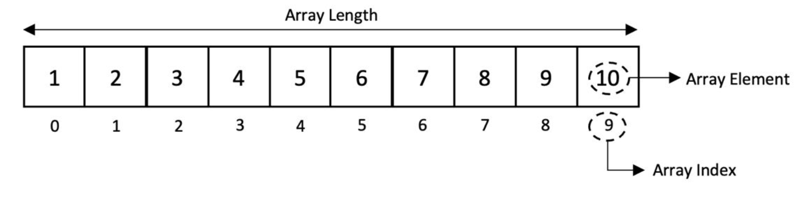

## Array: 

* Elements stored in contiguous memory.
* Fast random access.
* Efficient iteration.
* Insertion/deletion can be expensive when elements must be shifted.
* Fixed-size arrays and dynamic arrays have different resizing behavior.
