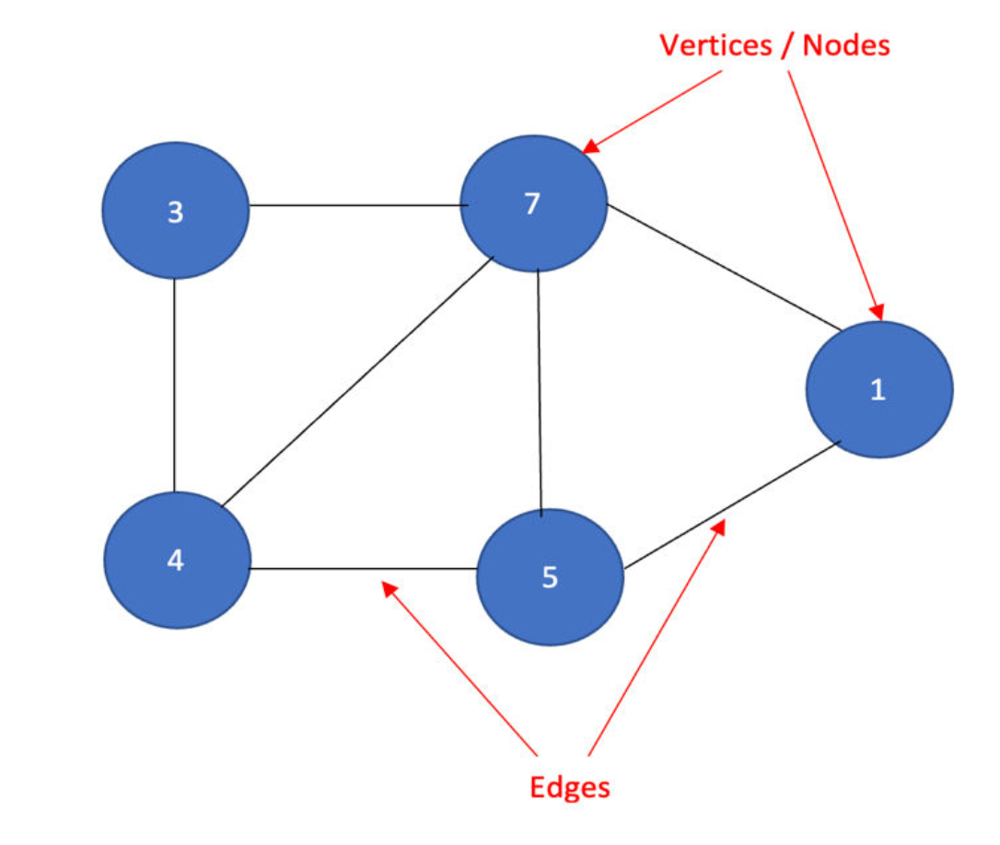

## Graph

Collection of vertices connected by edges.

### Types of Graphs

    * Directed Graph: Edges have direction.
    * Undirected Graph: Edges have no direction.
    * Weighted Graph: Edges have associated weights or costs.
    * Unweighted Graph: Edges have no weights.
    * Connected Graph: Vertices are reachable from one another.
    * Cycle: A path that returns to a previously visited vertex.
    
## Common Representations
    * Adjacency Matrix
    * Adjacency List
    * Edge List
    
## Common Algorithms
    * Breadth-First Search (BFS)
    * Depth-First Search (DFS)
    * Dijkstra's Algorithm
    * Bellman-Ford
    * Floyd-Warshall
    * Minimum Spanning Tree
    * Topological Sorting
