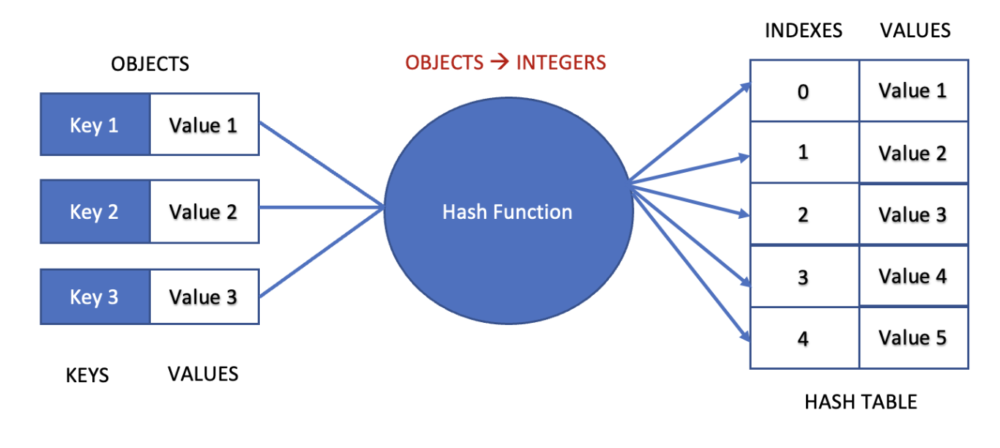

## Hash Tables and Hashing

* Stores key-value pairs using a hash function.
* Provides fast average-case lookup, insertion, and deletion.
* Hash Function: Converts a key into an index.
* Collision: Multiple keys map to the same location.
  
* Collision Handling:
    * Chaining
    * Open Addressing
    * Linear Probing
    * Quadratic Probing
      
* Applications:
    * Dictionaries
    * Sets
    * Caching
    * Counting frequencies
    * Fast membership testing
