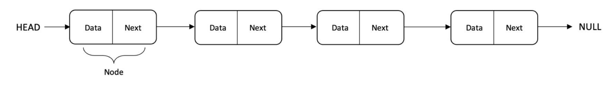
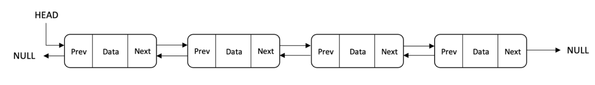
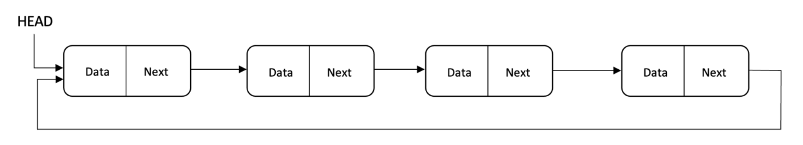
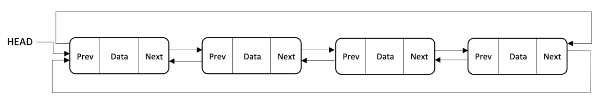

## Linked List

* Elements stored as nodes connected by links.
* Easy insertion/deletion when the position is known.
* Sequential access.
* Requires additional memory for links.
  
* Types of Linked Lists:
    * Singly Linked List
      
      

    * Doubly Linked List
      
      
      
    * Circular Linked List

      

      
