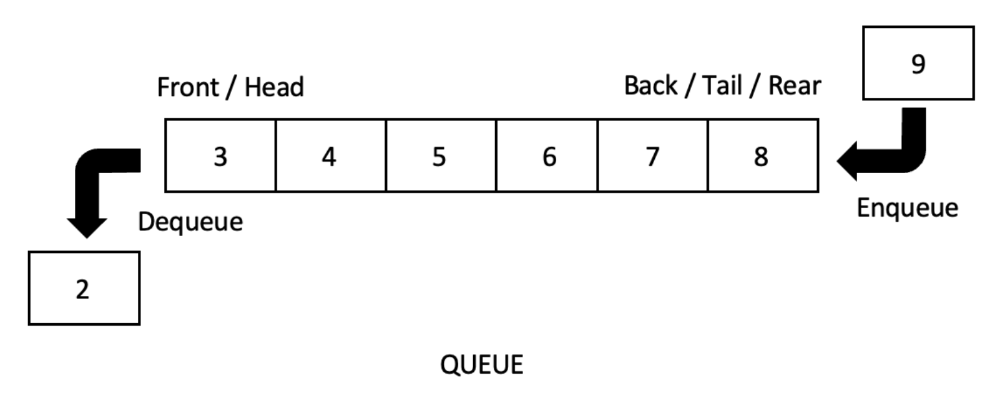

## Queues

* First In, First Out (FIFO).
* Operations: Enqueue, Dequeue, Front/Peek.
* Uses: Scheduling, buffering, task processing, BFS.
  
* Deque: Supports insertion and removal from both ends.
* Priority Queue: Removes elements according to priority rather than insertion order.
