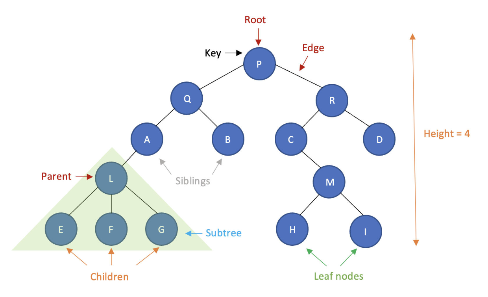
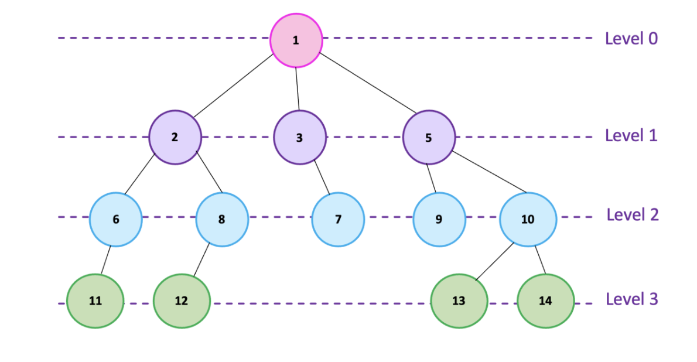

## Tree

Hierarchical structure consisting of nodes and edges.

### Main Components
  * Root: Top node.
  * Parent / Child: Hierarchical relationship between nodes.
  * Leaf: Node without children.
  * Depth: Distance from the root.
  * Height: Longest downward path from a node.

### Types of Tree

  * Binary Tree: Each node has at most two children.
  * Binary Search Tree (BST): Maintains an ordering that supports efficient searching.
  * Balanced Tree: Keeps its height controlled to maintain efficient operations.
